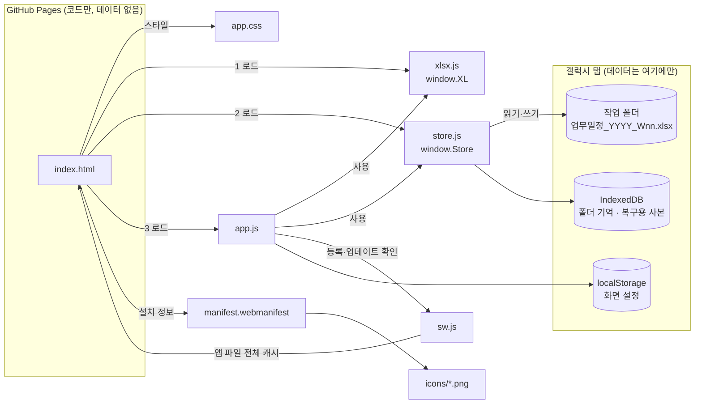

# 업무 일정 (PWA)

프로젝트별 Action Item을 주차 간트 차트로 관리하는 업무 TODO 앱입니다.
갤럭시 탭의 Chrome에서 **홈 화면에 설치(PWA)** 해서 사용하고, 데이터는 탭의 **작업 폴더에 주차별 엑셀 파일**로 저장합니다.

- 앱 버전: `1.0.6` (sw.js의 `VERSION`)
- 실행 환경: Android Chrome 132 이상 (삼성 인터넷은 작업 폴더 기능 미지원)
- 외부 라이브러리·CDN·외부 폰트: **없음**
- 업로드 방법: [DEPLOY.md](DEPLOY.md)

---

## 1. 파일 구성

| 파일 | 용도 | 코드 수정 시 |
|---|---|---|
| `index.html` | 앱 화면의 뼈대. CSP(외부 전송 차단) 선언, CSS·JS 연결 | 화면 구조를 바꿀 때 |
| `app.css` | 화면 스타일 (색상 토큰, 밝은/어두운 테마, 간트, 팝업) | 디자인을 바꿀 때 |
| `app.js` | 앱 본체: 화면 그리기, 편집, 상태 계산, 저장·불러오기 흐름, 업데이트 안내 | 기능을 바꿀 때 |
| `xlsx.js` | 엑셀(.xlsx) 파일 생성·읽기 (직접 구현) | 거의 없음 |
| `store.js` | 작업 폴더 접근, 브라우저 내부 저장(IndexedDB) | 거의 없음 |
| `sw.js` | 서비스 워커: 오프라인 실행, 업데이트 통제 | **배포할 때마다 `VERSION` 올림** |
| `manifest.webmanifest` | 설치 정보 (앱 이름, 아이콘, 전체 화면) | 이름·아이콘을 바꿀 때 |
| `icons/` | 앱 아이콘 3종 (192, 512, 마스크형 512) | 아이콘을 바꿀 때 |
| `.gitignore` | 엑셀 파일 등 업무 데이터가 저장소에 올라가지 않도록 차단 | 없음 |
| `README.md`, `DEPLOY.md` | 설명 문서 | — |

---

## 2. 참조 관계



텍스트 요약:
```
index.html ─┬─ app.css
            ├─ xlsx.js  (window.XL)    ← app.js 가 사용
            ├─ store.js (window.Store) ← app.js 가 사용
            ├─ app.js ── sw.js 등록
            └─ manifest.webmanifest ── icons/
store.js ── 작업 폴더(엑셀) / IndexedDB
app.js   ── localStorage(화면 설정)
```
스크립트는 `xlsx.js → store.js → app.js` 순서로 불러와야 합니다 (`index.html` 하단).

---

## 3. 파일별 내부 구조와 역할

### index.html
- `<meta http-equiv="Content-Security-Policy">`: 자기 주소의 파일만 허용, 외부 전송 차단
- 상단(`header.top`): 제목·날짜(주차) / [저장] [설정] / 저장 상태 / [프로젝트] / [주차 보기][필터 3종] / 상태 요약
- `#update`: 새 버전 안내 띠, `#banners`: 상황 안내 띠, `#main`: 간트 영역
- `#start`: 시작 화면 (폴더 선택, 권한 확인, 복구)

### app.js (주요 구획 순서)
| 구획 | 역할 |
|---|---|
| 유틸 | 날짜 변환, 화면 요소 생성 `h()` (사용자 입력은 `textContent`로만 넣음) |
| 상태 | 화면 설정(접기·필터·화면 방향)은 localStorage, 업무 데이터는 메모리 `S` |
| 날짜·주차 | 주 시작 일요일 고정. 그 해 1월 1일이 들어 있는 주 = W01 |
| 상태 계산 | 목표 대비 실제: 예정 / 진행 / 지연 / 착수지연 / 완료, 지연 일수 |
| 엑셀 ↔ 데이터 | 시트 행 ↔ 프로젝트·할일 변환 (머리글 이름으로 열을 찾음) |
| 저장 | `changed()` → 복구용 사본 보관 + 0.4초 후 자동 저장. `saveNow()` → 작업 폴더에 파일 쓰기 |
| 화면 | 상단, 안내 띠, 간트(가로: 다음 해 3월까지, 세로: 금주부터 3주), 편집창 |
| 팝업 | 프로젝트 관리, 주차 보기, 설정(작업 폴더·현재 파일 이름, 화면 방향) |
| 시작 화면 | 폴더 선택 / 권한 확인 / 파일 손상·미저장 변경 복구 |
| 서비스 워커 | 등록, 새 버전 감지 → 안내 띠 → [업데이트]를 눌러야 교체 |

### xlsx.js
- `XL.build(sheets)`: ZIP(무압축) + Office Open XML로 .xlsx 생성. 날짜는 엑셀 날짜 형식, 비고는 줄바꿈 표시
- `XL.parse(buffer)`: .xlsx 읽기. 엑셀이 다시 저장한 압축 파일은 브라우저 내장 `DecompressionStream`으로 풀어서 읽음

### store.js
- `Store.kv`: IndexedDB 키-값 저장 (`dir`: 작업 폴더 핸들, `cache`: 복구용 마지막 상태)
- `Store.folder`: `pick()` 폴더 선택, `permission()` 권한 확인·요청, `list()` 주차 파일 목록, `read()` / `write()`

### sw.js
- 설치: 앱 파일 전체를 Cache Storage에 저장 (`work-schedule-<VERSION>`)
- 요청 처리: 캐시 우선 → 오프라인에서도 실행
- 업데이트: 새 버전은 **대기**만 함. 앱에서 [업데이트] → `SKIP_WAITING` 메시지 → 교체 후 새로고침

---

## 4. 데이터 저장 규칙

| 항목 | 내용 |
|---|---|
| 파일명 | `업무일정_YYYY_Wnn.xlsx` — YYYY: 연도, nn: 주차 번호(01~53). 예: `업무일정_2026_W41.xlsx`, 다음 주는 `업무일정_2026_W42.xlsx` |
| 불러오기 | 앱 시작 시 작업 폴더에서 연도·주차가 가장 큰 파일 |
| 저장 대상 | 이번 주 파일 (같은 주에는 같은 파일을 덮어씀) |
| 지난 주차 파일 수정 시 | 이번 주 파일로 새로 생성 (지난 파일은 그대로 남음) |
| 이력 관리 | 앱에서는 하지 않음. 작업 폴더의 주차별 파일을 직접 관리(보관·복사·삭제) |
| 저장 시점 | 편집창이 닫힐 때 자동 + [저장] 버튼 + 앱을 벗어날 때 |
| 파일 손상·미저장 대비 | 변경할 때마다 IndexedDB에 사본 보관 → 시작 시 비교해 복구 화면 표시 |

**엑셀 시트 구성** (파일마다 시트 1개, 시트 이름: `업무일정`. 주차는 파일명으로 구분)

| 열 | 내용 | 가져올 때 |
|---|---|---|
| 프로젝트 | 프로젝트 이름 (행 순서 = 프로젝트 순서) | 필수 |
| 프로젝트 비고 | 프로젝트의 첫 행에만 기록 | 사용 |
| Action Item | 할일 이름 (비어 있으면 할일 없는 프로젝트) | 필수 |
| 목표 시작 / 목표 완료 / 실제 시작 / 실제 완료 | 엑셀 날짜 | 사용 |
| 상태 / 지연(일) | 저장 시점 기준 계산값 | 무시 (다시 계산) |
| 비고 | 계획·결과 | 사용 |

PC 엑셀에서 수정해도 됩니다. 단, **머리글 이름은 바꾸지 마세요.** 열 순서는 바뀌어도 됩니다.

---

## 5. 보안 설계

| 대책 | 막는 것 | 위치 |
|---|---|---|
| 데이터는 탭의 작업 폴더에만 저장 | 서버로의 데이터 유출 | store.js |
| CSP `connect-src 'self'` 등 | 앱이 외부로 데이터를 보내는 것 | index.html |
| 외부 라이브러리·CDN 미사용 | 외부 코드 변조의 영향 | 전체 |
| 자동 업데이트 끄기 | 남이 바꾼 코드가 탭에서 실행되는 것 | sw.js, app.js |
| `.gitignore`로 엑셀 제외 | 업무 파일이 저장소에 올라가는 것 | .gitignore |
| GitHub 2단계 인증 | 남이 코드를 바꾸는 것 | GitHub 계정 설정 |
| 사용자 입력은 `textContent`로만 표시 | 스크립트 삽입(XSS) | app.js |

---

## 6. 외부 소스 정리

**실행 중 불러오는 외부 리소스: 없음** (CDN, 외부 스크립트, 외부 폰트, 외부 CSS, 외부 이미지, 분석 도구 모두 없음)

브라우저 내장 기능 (설치 불필요):

| 기능 | 사용 위치 | 용도 |
|---|---|---|
| File System Access API (`showDirectoryPicker`) | store.js | 작업 폴더 읽기·쓰기 |
| IndexedDB | store.js | 폴더 기억, 복구용 사본 |
| localStorage | app.js | 화면 설정 |
| Service Worker, Cache Storage | sw.js | 오프라인 실행, 업데이트 통제 |
| DecompressionStream, DOMParser | xlsx.js | 엑셀 파일 압축 해제·XML 해석 |

참고 규격·문서:
- [File System Access API – Chrome for Developers](https://developer.chrome.com/docs/capabilities/web-apis/file-system-access)
- [Intent to Ship: File System Access on Android – Chromium](https://groups.google.com/a/chromium.org/g/blink-dev/c/x3IcFv2jY6c)
- [Learn PWA – web.dev](https://web.dev/learn/pwa/)
- [Content Security Policy – MDN](https://developer.mozilla.org/en-US/docs/Web/HTTP/CSP)
- [ECMA-376 Office Open XML](https://ecma-international.org/publications-and-standards/standards/ecma-376/)
- [ZIP 파일 형식 APPNOTE – PKWARE](https://pkware.cachefly.net/webdocs/casestudies/APPNOTE.TXT)

---

## 7. 코드 수정 후 배포 규칙
1. 파일을 수정합니다.
2. **`sw.js`의 `VERSION`을 올립니다.** (예: `1.0.0` → `1.0.1`) 이 값이 바뀌어야 탭이 새 버전을 알아챕니다.
3. 바뀐 파일을 GitHub에 올립니다. ([DEPLOY.md](DEPLOY.md) 6단계)
4. 탭에서 앱을 열면 "새 버전(1.0.1)" 안내가 뜹니다 → [업데이트].
5. **직접 올린 적이 없는데 안내가 뜨면 누르지 마세요.** (코드 변조 신호)
